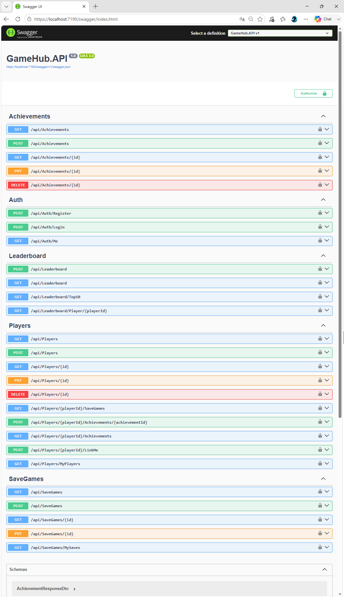
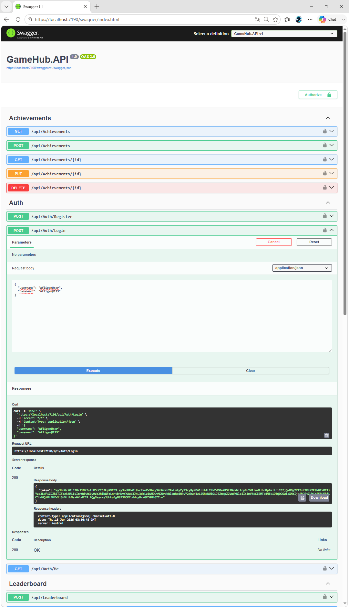
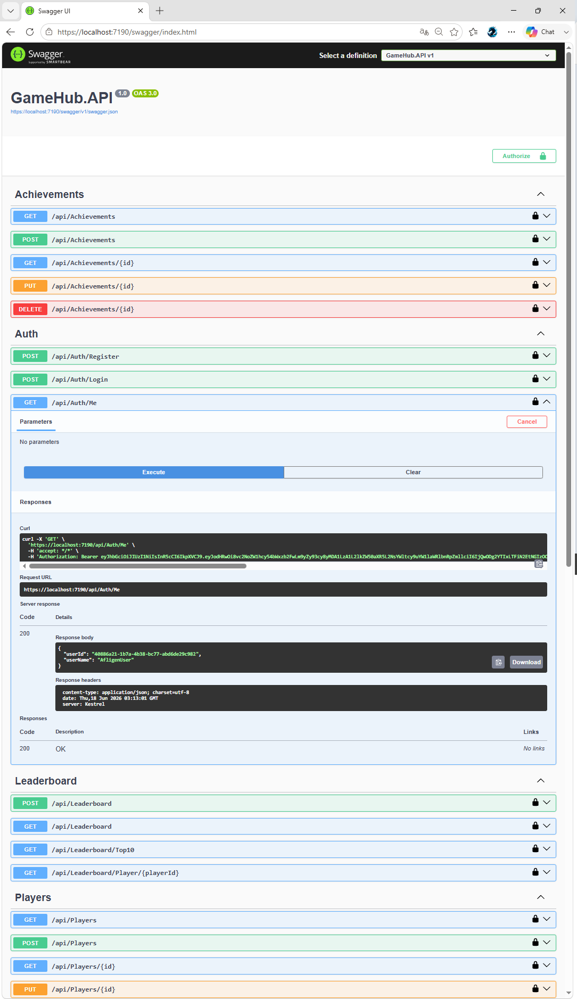
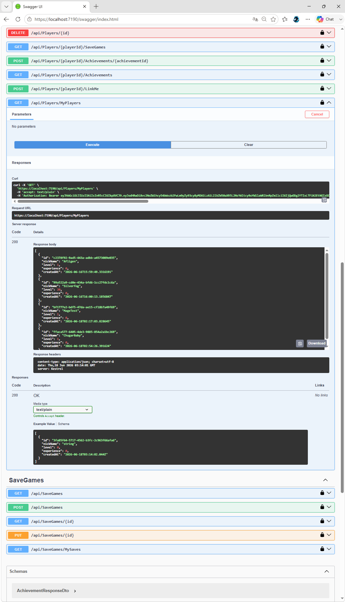
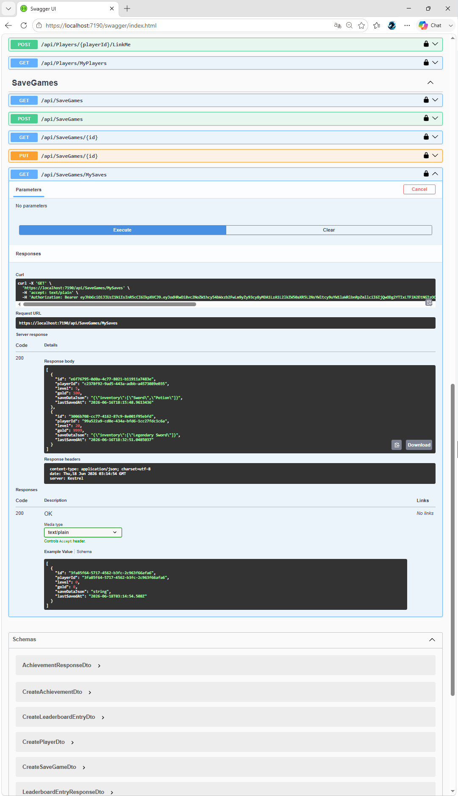
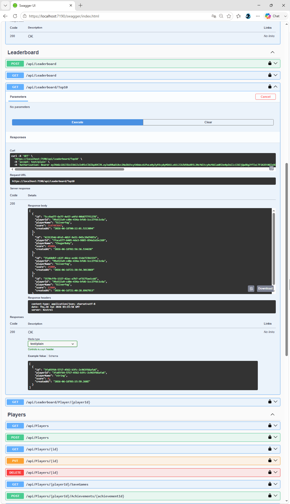

# 🎮 GameHub API 2.0


REST API for Game Services built with ASP.NET Core 8, Entity Framework Core, SQLite, Identity and JWT Authentication.

## 🇧🇷 Português

GameHub API é uma API REST desenvolvida em ASP.NET Core 8 para gerenciamento de jogadores, conquistas, save games e rankings de jogos.

O projeto foi criado com foco em boas práticas de desenvolvimento backend utilizando C#, Entity Framework Core, SQLite, Identity e autenticação JWT.

---

# 🚀 Continuous Integration

GameHub API 2.0 uses GitHub Actions to automatically validate every commit pushed to the repository.

The CI pipeline performs the following tasks:

- ✅ Restore project dependencies
- ✅ Build the solution
- ✅ Execute all automated tests
- ✅ Cache NuGet packages
- ✅ Upload test artifacts
- ✅ Validate Docker image build
- ✅ Prevent concurrent workflow execution
- ✅ Enforce execution timeout

This guarantees that every commit maintains the project's integrity and build quality.

---

## 🚀 Tecnologias Utilizadas

* ASP.NET Core 8
* C#
* Entity Framework Core
* SQLite
* ASP.NET Identity
* JWT Authentication
* Swagger / OpenAPI
* LINQ
* REST API

---

## 📚 Funcionalidades

### Autenticação

* Cadastro de usuários
* Login com JWT
* Endpoint para obter usuário autenticado
* Proteção de rotas com `[Authorize]`

### Players

* Criar jogador
* Listar jogadores
* Buscar jogador por ID
* Atualizar jogador
* Soft Delete
* Vincular jogador ao usuário autenticado
* Listar personagens da conta (`MyPlayers`)

### Save Games

* Criar Save Game
* Atualizar Save Game
* Buscar Save Games
* Listar saves do usuário autenticado (`MySaves`)

### Achievements

* Criar conquistas
* Atualizar conquistas
* Remover conquistas
* Desbloquear conquistas para jogadores
* Consultar conquistas desbloqueadas

### Leaderboard

* Registrar pontuação
* Consultar ranking geral
* Top 10 jogadores
* Ranking por jogador

---

## 🔐 Fluxo de Autenticação

```text
Register
   ↓
Login
   ↓
JWT Token
   ↓
Authorize (Swagger)
   ↓
Endpoints Protegidos
```

---

## 🗄️ Modelo Simplificado

```text
ApplicationUser
        │
        ├── Players
        │      ├── SaveGames
        │      └── Achievements
        │
        └── JWT Authentication
```

---

## 📷 Demonstração

### Swagger Overview



### Login e Geração de Token JWT



### Autorização no Swagger



### My Players



### My Saves



### Leaderboard Top 10



---

## ▶️ Executando o Projeto

### Clonar repositório

```bash
git clone https://github.com/SEU-USUARIO/GameHub.API.git
```

### Restaurar dependências

```bash
dotnet restore
```

### Aplicar migrations

```bash
dotnet ef database update
```

### Executar

```bash
dotnet run
```

Swagger:

```text
https://localhost:7190/swagger
```

---

## 🎯 Objetivo

Este projeto foi desenvolvido para estudo de desenvolvimento backend utilizando .NET, simulando funcionalidades comuns encontradas em plataformas de jogos online como Steam, Battle.net, Epic Games e Riot Games.

---

# 🇺🇸 English

## Overview

GameHub API is a REST API built with ASP.NET Core 8 for managing players, achievements, save games and leaderboards.

The project focuses on modern backend development practices using C#, Entity Framework Core, SQLite, Identity and JWT Authentication.

---

## 🚀 Technologies

* ASP.NET Core 8
* C#
* Entity Framework Core
* SQLite
* ASP.NET Identity
* JWT Authentication
* Swagger / OpenAPI
* LINQ
* REST API

---

## Features

### Authentication

* User registration
* JWT login
* Authenticated user endpoint
* Protected routes with `[Authorize]`

### Players

* Create player
* List players
* Get player by ID
* Update player
* Soft delete
* Link player to authenticated account
* List account characters (`MyPlayers`)

### Save Games

* Create save game
* Update save game
* Retrieve save games
* List authenticated user saves (`MySaves`)

### Achievements

* Create achievements
* Update achievements
* Delete achievements
* Unlock achievements
* Retrieve unlocked achievements

### Leaderboard

* Submit score
* Global ranking
* Top 10 players
* Player ranking

---

## Architecture

```text
ApplicationUser
        │
        ├── Players
        │      ├── SaveGames
        │      └── Achievements
        │
        └── JWT Authentication
```

---

## Goal

This project was built as a backend portfolio project demonstrating modern .NET development practices and common game platform features.

Inspired by systems found in:

* Steam
* Epic Games
* Battle.net
* Riot Games

```
```

